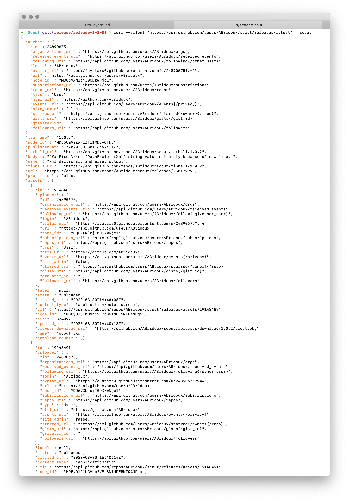

<p  align="center">

<br>
Swift package<br>
    <a href="#">
        
    </a>
    <a href="https://swift.org/package-manager">
        
    </a>
    <a href="https://github.com/ABridoux/scout/actions?query=workflow%3ASwift">
        
    </a>
    <br/>
Install<br>
    <a href="#">
        
    </a>
     <a href="https://github.com/ABridoux/scout/releases">
        
    </a>
    <a href="#">
        
    </a>
    <br/>
</p>

# Scout <a href="https://github.com/ABridoux/scout/releases"></a>

This library aims to make specific formats data values reading and writing simple when the data format is not known at build time.
It was inspired by [SwiftyJson](https://github.com/SwiftyJSON/SwiftyJSON) and all the projects that followed, while trying to cover more ground, like Xml or Plist. It unifies writing and reading for those different formats. Getting a value in a Json format would be the same as getting a value in a Xml format.

## Summary
- [Why](#why)
- [Features](#features)
- [Installation](#installation)
- [Usage](#usage)
- [Special thanks](#special-thanks)
- [Contributing](#contributing)

## Why?

With the Foundation libraries to encode/decode Json and Plist, one could ask: why would someone need Scout? Simple answer: there are still cases where you do not know the data format. Sometimes, you will just want to read a single value from a Plist file, and you do not want to create the the `struct` to decode this file. Or you simply cannot know the data format at build time.

### Context
I have been working with many Mac admins recently, and many had to deal with Json, Plist and Xml data. While some were using a format-specific library like [jq](https://stedolan.github.io/jq/) to parse Json, others were using **awk**.  Each approach is valid, though it comes with some tradeoffs.

#### Using a format-specific library
You can use a library for each format. But I am not aware today of a library that unifies all of them. So, what you learnt with [jq](https://stedolan.github.io/jq/) cannot be reused to parse Plist data. You would have to learn to use **PlistBuddy** or the **defaults** command. With Scout, you can parse the same way Json, Plist and Xml data.

#### Using a generic text-processing tool
Don't get me wrong, **awk** is a wonderful tool. It can do so many things. But it is not that easy to learn. And you have to find a way to parse each different format. **Scout** is really easy to use, as we will see.

<br>

## Features
- CRUD functions for JSON, Plist and XML data format
  - Set a key name
  - Force a type
  - Dictionary and array count
- Use paths to specify the target value
- Stream or file input
- Find best match in case of a typo
- Syntax highlighting

### Details

#### CRUD functions for JSON, Plist and XML data format
- add a value (Create)
- read a value (Read)
- set a value (Update)
- delete a value (Delete)

See the [usage example](#usage).

##### Set key name
Set a key name rather than its value. See the [usage example](#usage).

##### Try to force a type
Prevent the automatic inferring of a type and try to force one when setting or adding a value. See the [usage example](#usage).

##### Dictionary and array count
Get a dictionary or an array count with the `[#]` symbol. See the [usage example](#usage).

#### Use paths to specify the value to target
A path is a sequence of keys or symbols to navigate through the data. See the [usage example](#usage).

#### Stream or file input
Set the input as a file with the input option `-i | --input` or as the last process/command output with a pipe:
```bash
scout "path.to.value" -i File
# is the same as
cat File | scout "path.to.value"
```

#### Find best match in case of a typo
Scout uses the Jaro-Winkler distance to indicate which key is the closest to an unresolved key.

#### Syntax highlighting
Scout will highlight the output when reading or outputting (with the verbose flag) a dictionary or an array value. This is done with the [Lux](https://github.com/ABridoux/lux) library. You can try it with the following command.

```bash
curl --silent "https://api.github.com/repos/ABridoux/scout/releases/latest" | scout
```



Another example with one of the playground files and the following command:

```bash
scout -i People.plist "people.Robert.age=2" -v
```

When dealing with large files (although it is not recommended to ouput large files in the terminal), colorising the ouput might bring to slowdowns. You can deactivate the colorisation with the flag `--no-color`.

##### Customise colors
You can specify your own color set as explained [here](https://github.com/ABridoux/scout/wiki/%5B30%5D-Syntax-highlighting:-custom-colors). Also, some presets for the macOS terminal default styles can be found in the [Highlight presets folder](Highlight-presets)

<br>

## Installation

### Command Line

#### Homebrew
Use the following command.

```bash
brew install ABridoux/formulae/scout
```
It will **download the notarized executable** from the [latest release](https://github.com/ABridoux/scout/releases/latest/download/scout.zip). I believe that most Homebrew users do not really care about building the program themselves. If I am wrong, please let me know (by opening an [issue](https://github.com/ABridoux/scout/issues) for example). Note that you can still build the program by cloning this git as explained below.


#### Download

You can download the [latest version of the executable](https://github.com/ABridoux/scout/releases/latest/download/scout.zip) from the [releases](https://github.com/ABridoux/scout/releases). Note that the **executable is notarized**. Also, a notarized [scout package](https://github.com/ABridoux/scout/releases/latest/download/scout.pkg) is provided.

After having unzipped the file, you can install it if you want to. The second line lets you install the script to auto-complete the commands.

```bash
$ install scout /usr/local/bin/ 
$ scout install-completion-script
```

Here is a command which downloads the latest version of the program and install it in */usr/local/bin*. 
Run it to download and install the latest version of the program. It erases the current version you may have. The last line is optional and installs the script to auto-complete the commands.

```bash
curl -LO https://github.com/ABridoux/scout/releases/latest/download/scout.zip && \
unzip scout.zip && \
rm scout.zip && \
install scout /usr/local/bin && \
rm scout && \
scout install-completion-script
```

##### Note
- To find all scout versions, please browse the [releases](https://github.com/ABridoux/scout/releases) page.
- When deploying a package (with a MDM for example), it might be useful to add the version to the name. To get scout latest version: simply run `scout version` to get your **installed scout version**, or ` curl --silent "https://api.github.com/repos/ABridoux/scout/releases/latest" | scout tag_name` to get the latest version **available on the Github repository**.

#### Git

Use the following lines to clone the repository and to install **scout** (requires Swift 5.2 toolchain to be installed). You can check the *Makefile* to see the commands used to build and install the executable. The last line is optional and lets you install the script to auto-complete the commands.

```bash
$ git clone https://github.com/ABridoux/scout
$ cd scout
$ make
$ scout install-completion-script
```

The program should be install in */usr/local/bin*. You can then remove the repository if you do not want to keep it:

```bash
$ cd ..
$ rm -r Scout
```

### Swift package

Start by importing the package in your file *Packages.swift*.
```swift
let package = Package (
    ...
    dependencies: [
        .package(url: "https://github.com/ABridoux/scout", from: "1.0.0")
    ],
    ...
)
```
You can then `import Scout` in a file.

<br>

## Usage

### Playground
You can find and try examples with one file *People* using the different available formats in the [Playground folder](Playground). The folder contains a *Commands.md* file so that you can see how to use the same commands to parse the different formats.

### Examples and explanations (wiki)
[Command-line](https://github.com/ABridoux/scout/wiki/%5B20%5D-Usage-examples:-command-line)

[Swift](https://github.com/ABridoux/scout/wiki/%5B21%5D-Usage-examples:-Swift-package)

<br>

## Special thanks
To parse and edit XML data, as the standard library does not offer a simple way to do it, **Scout** uses the wonderful library of Marko Tadić: [AEXML](https://github.com/tadija/AEXML). He has done an amazing work. And if several XML parsing and writing libraries exist today, I would definitely recommend his. Marko, you might never read those lines, but thank you!

Thanks also to the team at Apple behind the [ArgumentParser](https://github.com/apple/swift-argument-parser) library. They have done an incredible work to make command line tools in Swift easy to implement.

Finally, thanks to [Thijs Xhaflaire](https://github.com/txhaflaire/) and [Armin Briegel](https://github.com/scriptingosx) for your ideas and your helpful feedback.

### References
Font used for the logo: Ver Army by [Damien Gosset](http://sweeep.fr/cv/index.php?c=fonts).

<br>

## Contributing
Scout is open-source and under a [MIT license](License). If you want to make a change or to add a new feature, please [open a Pull Request](https://github.com/ABridoux/scout/pull/new). You can learn more about contributing on this [wiki page](https://github.com/ABridoux/scout/wiki/%5B81%5D-Contributing).
Also, feel free to [report a bug, an error or even a typo](https://github.com/ABridoux/scout/issues).

