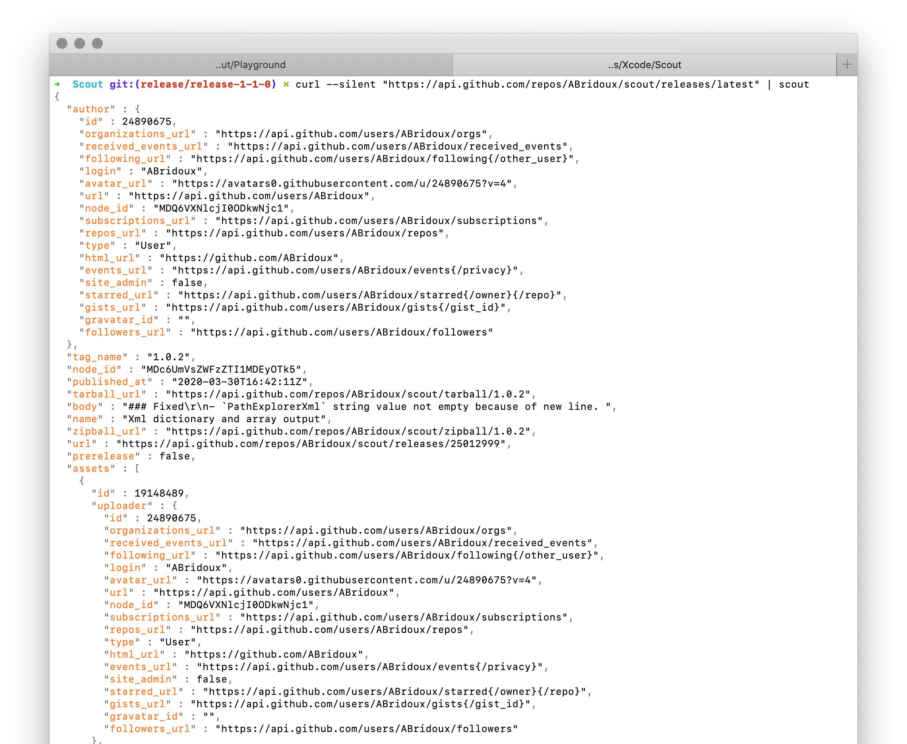
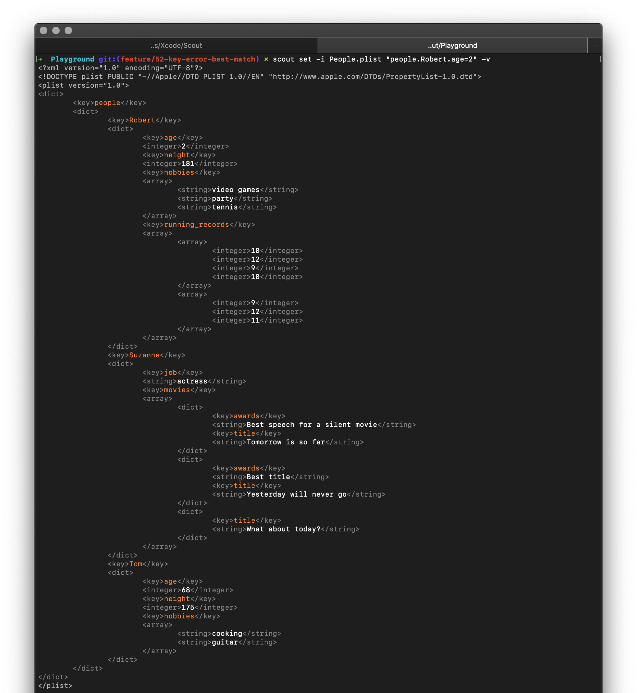

<p  align="center">

<br>
Swift package:<br>
    <a href="#">
        
    </a>
    <a href="https://swift.org/package-manager">
        
    </a>
    <a href="https://github.com/ABridoux/scout/actions?query=workflow%3ASwift">
        
    </a>
    <br/>
Install:<br>
    <a href="#">
        
    </a>
     <a href="https://github.com/ABridoux/scout/releases">
        
    </a>
    <br/>
</p>

# Scout <a href="https://github.com/ABridoux/scout/releases"></a>

This library aims to make specific formats data values reading and writing simple when the data format is not known at build time.
It was inspired by [SwiftyJson](https://github.com/SwiftyJSON/SwiftyJSON) and all the projects that followed, while trying to cover more ground, like Xml or Plist. It unifies writing and reading for those different formats. Getting a value in a Json format would be the same as getting a value in a Xml format.

## Why?

With the Foundation libraries to encode/decode Json and Plist, one could ask: why would someone need Scout? Simple answer: there are still cases where you do not know the data format. Sometimes, you will just want to read a single value from a Plist file, and you do not want to create the the `struct` to decode this file. Or you simply cannot know the data format at build time.

## Context
I have been working with many Mac admins recently, and many had to deal with Json, Plist and Xml data. While some where using a format-specific library like [jq](https://stedolan.github.io/jq/) to parse Json, others where using **awk**.  Each approach is valid, though it comes with some compromises.

### Using a format-specific library
You can use a library for each format. But I am not aware today of a library that unifies all of them. So, what you learnt with [jq](https://stedolan.github.io/jq/) cannot be reused to parse Plist data. You would have to learn to use **PlistBuddy** or the **defaults** command. With Scout, you can parse the same way Json, Plist and Xml data.

### Using a generic text-processing tool
Don't get me wrong, **awk** is a wonderful tool. It can do so many things. But it is not that easy to learn. And you have to find a way to parse each different format. **Scout** is really easy to use, as we will see.

## Syntax highlighting
Starting from 1.1.0, Scout will highlight the output when reading or outputting (with the verbose flag) a dictionary or an array value. This is done with the [Lux](https://github.com/ABridoux/lux) library. You can try it with the following command.

```bash
curl --silent "https://api.github.com/repos/ABridoux/scout/releases/latest" | scout
```



Another example with one of the playground files and the following command:

```bash
scout -i People.plist "people.Robert.age=2" -v
```



### Customise colors
You can specify your own color set as explained [here](https://github.com/ABridoux/scout/wiki/%5B30%5D-Syntax-highlighting:-custom-colors). Also, some presets for the macOS terminal default styles can be found in the [Highlight presets folder](Highlight-presets)

<br>

## How to use it

### Command Line

#### Homebrew
Use the following command.

```bash
brew install ABridoux/formulae/scout
```
It will **download the notarized executable** from the [latest release](https://github.com/ABridoux/scout/releases/latest/download/scout.zip). I believe that most Homebrew users do not really care about building the program themselves. If I am wrong, please let me know (by opening an [issue](https://github.com/ABridoux/scout/issues) for example). Note that you can still build the program by cloning this git as explained below.


#### Download

You can download the [latest version of the executable](https://github.com/ABridoux/scout/releases/latest/download/scout.zip) from the [releases](https://github.com/ABridoux/scout/releases). Note that the **executable is notarized**. Also, a notarized [scout package](https://github.com/ABridoux/scout/releases/latest/download/scout.pkg) is provided.

After having unzipped the file, you can install it if you want to:

```bash
install scout /usr/local/bin/ 
```

Here is a command which downloads the latest version of the program and install it in */usr/local/bin*. 
Run it to download and install the latest version of the program. It erases the current version you may have.

```bash
curl -LO https://github.com/ABridoux/scout/releases/latest/download/scout.zip && \
unzip scout.zip && \
rm scout.zip && \
install scout /usr/local/bin && \
rm scout
```

##### Note
- To find all scout versions, please browse the [releases](https://github.com/ABridoux/scout/releases) page.
- When deploying a package (with a MDM for example), it might be useful to add the version to the name. To get scout latest version: simply run `scout version` to get your **installed scout version**, or ` curl --silent "https://api.github.com/repos/ABridoux/scout/releases/latest" | scout tag_name` to get the latest version **available on the Github repository**.

#### Git

Use the following lines to clone the repository and to install **scout** (requires Swift 5.2 toolchain to be installed). You can check the *Makefile* to see the commands used to build and install the executable.

```bash
$ git clone https://github.com/ABridoux/scout
$ cd scout
$ make
```

The program should be install in */usr/local/bin*. You can then remove the repository if you do not want to keep it:

```bash
$ cd ..
$ rm -r Scout
```

### Swift package

Start by importing the package in your file *Packages.swift*.
```swift
let package = Package (
    ...
    dependencies: [
        .package(url: "https://github.com/ABridoux/scout", from: "0.1.0")
    ],
    ...
)
```
You can then `import Scout` in a file.

## Usage examples

### Playground
You can find and try examples with one file *People* using the different available formats in the [Playground folder](Playground). The folder contains an *Example commands* file so that you can see how to use the same commands to parse the different formats.

### Examples and specificities
[Command-line](https://github.com/ABridoux/scout/wiki/%5B20%5D-Usage-examples:-command-line)

[Swift](https://github.com/ABridoux/scout/wiki/%5B21%5D-Usage-examples:-Swift-package)

## Special thanks
To parse Xml data, as the standard library does not offer simple way to do it, **Scout** uses the wonderful library of Marko Tadić: [AEXML](https://github.com/tadija/AEXML). He has done an amazing work. And if several Xml parsing and writing libraries exist today, I would definitely recommend his. Marko, you might never read those lines, but thank you again!

Thanks also to the team at Apple behind the [ArgumentParser](https://github.com/apple/swift-argument-parser) library. They have done an incredible work to make command line tools in Swift easy to implement.

Finaly, thanks to [Thijs Xhaflaire](https://github.com/txhaflaire/) for your ideas and your helpful feedback.

## Contributing
Scout is open-source and under a [MIT license](License). If you want to make a change or to add a new feature, please [open a Pull Request](https://github.com/ABridoux/scout/pull/new).
Also, feel free to [report a bug, an error or even a typo](https://github.com/ABridoux/scout/issues).

